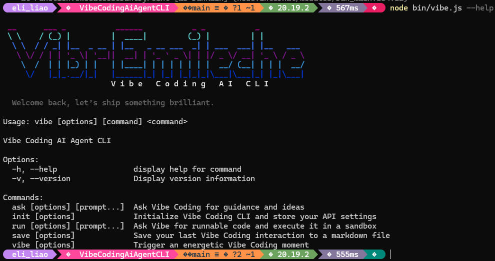

# Vibe Coding AI Agent CLI

Vibe Coding 是專為習慣命令列流程的 Node.js 開發者打造的 AI 夥伴。透過這個 CLI，你可以向 OpenAI（或內建模擬服務）提問、生成可執行的 JavaScript 程式碼，並保存互動過程，讓日常開發更順手。



## 系統需求
- Node.js 20 以上版本
- 建議（非必須）準備 OpenAI API Key

## 安裝與啟動
1. 安裝依賴
   ```bash
   npm install
   ```
2. 試用 CLI（兩種方式擇一）
   - 使用 `npx .` 臨時執行：
     ```bash
     npx . --help
     ```
   - 建立全域指令，之後可直接輸入 `vibe`：
     ```bash
     npm link
     vibe --help
     ```

## 快速上手
```bash
# 先設定金鑰與偏好（未填會提醒，可用 Enter 跳過）
vibe init

# 問一個問題，查看 AI 給的建議
vibe ask "如何在 Node.js 內快速讀寫 JSON?"

# 產生並執行一段程式碼（預設用真實 API，無金鑰則退回 mock）
vibe run "寫一個 CLI 讀取 data.json 並印出統計"

# 將最近互動輸出成 Markdown
vibe save --output latest-session.md

# 需要打氣時：
vibe vibe
```

## 指令一覽
### `vibe init`
- 設定或更新 API Key、模型與 API Endpoint。
- 未輸入 API Key 也可以繼續使用，此時會啟用模擬模式。

### `vibe ask [prompt...]`
- 向 AI 詢問技術問題，輸出文字建議。
- 範例：
  ```bash
  vibe ask "如何效能最佳化 Express 中的 middleware?"
  ```

### `vibe run [prompt...]`
- 要求 AI 產生可執行 JavaScript，並於沙盒中執行。
- 常見選項：
  - `--show-code` 執行前先印出產生的程式碼。
  - `--timeout 12000` 自訂沙盒逾時（毫秒）。
  - `--mock` 強制使用內建模擬範本。
- 範例：
  ```bash
  # 顯示程式碼後再執行
  vibe run --show-code "計算前 100 個費波那契數的總和"
  ```

### `vibe save`
- 把最近一次互動匯出成 Markdown 方便分享。
- 範例：
  ```bash
  vibe save --output reports/2024-10-09.md
  ```

### `vibe vibe`
- 顯示即時的打氣訊息，也可由 AI 客製口號。
- 範例：
  ```bash
  vibe vibe --prompt "幫我寫一段給前端團隊的鼓勵"
  ```

## 設定與資料位置
- 認證與偏好：`%USERPROFILE%\.vibe\config.json`
- 互動歷史：`%USERPROFILE%\.vibe\history.json`
- CLI 啟動時會自動載入 `.env` 或 `VIBE_DOTENV` 指向的檔案。

## 開發筆記
- 除了這份 README，還可以參考專案根目錄的 `CODEX.md`。裡面整理了指令架構、模組關係與常用流程，方便日後維護或交接時快速掌握重點。

## 模擬模式
- 未提供 API Key、或在指令加上 `--mock` 時會啟用。
- 回覆會附上建議步驟與範例程式碼，適合 Demo 或教學。

## 發布流程（開發者）
1. 更新 `package.json` 版本號。
2. 確認測試或手動驗證通過。
3. 執行 `npm publish` 推送到套件註冊中心。
